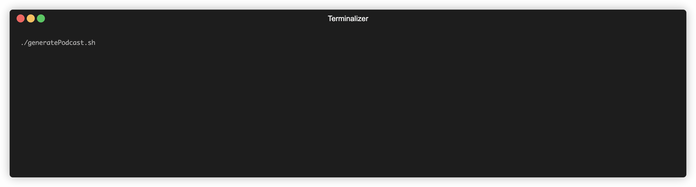
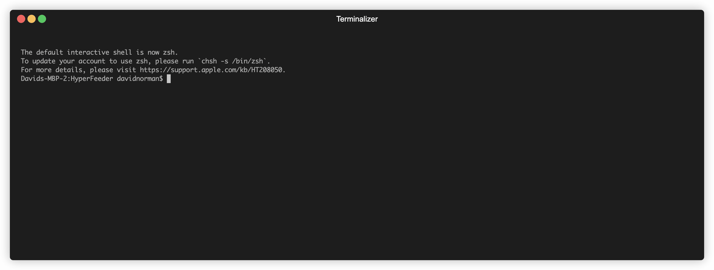

# HyperFeeder - Autonomous Podcast Generator

<!-- ALL-CONTRIBUTORS-BADGE:START - Do not remove or modify this section -->
[](#contributors-)
<!-- ALL-CONTRIBUTORS-BADGE:END -->
[](https://github.com/normand1/HyperFeeder/actions/workflows/main.yml)

HyperFeeder generates a personally tailored podcast -- just for you (or your audience)! 

HyperFeeder is a fully configurable and extensible framework for building automated podcasts however you want.
HyperFeeder uses a plugin system that generates a podcast step by step from Intro and music to individual podcast segments and news stories to how the podcast will be arranged and presented.
At each step you can either choose from an existing list of plugins that will generate different kinds of content or simply write your own plugin for any step of the podcast generation process.

With existing tools and plugins you can currently build a podcast with data from Hacker News, Reddit, any podcast with transcripts in the RSS Feed, RSS Newsletters like those on Substack. The plan is to expand this tool to ingest many different configurable sources for building podcast content from as well as new sources for augmenting the source content. See the [Issues Tab](https://github.com/normand1/HyperFeeder/issues) for the planned and in-progress roadmap. Also, feel free to open new issues for feature requests or pull requests for new features you'd like to contribute back.



## Project Goals
- The podcasts produced by this framework should be fully autonomous and need no human intervention to search for content, generate audio, compose audio segments, produce instrospective metadata about podcast content and publish to a podcast feed. (In progress)
- Anyone should be able to submit easily composable new features that can help make all autonomous podcasts better. (In Progress)
- Any source of data can be a source of podcast content. (In Progress)

## Autonomous Podcast Feeds (Submit yours to have it featured here!)
- https://www.podfriend.com/podcast/autonomous-tech-podcast-hyperfeed/

## Prerequisites

- For the text to speech generation script I use [say](https://ss64.com/osx/say.html) for simplicity right now which is only available on MacOS. I welcome Pull Requests to update the script or add new versions of the script for text-to-speech compatabillity with other systems.

- For audio Stitching this project uses [FFMPEG which can be downloaded for any system here](https://ffmpeg.org/download.html)

- You will need Python version 3.9.17 or newer. If your Python version is older, you can use `pyenv` to manage multiple versions of Python on your system. Here's how to do it:

    - If you don't have `pyenv` installed, you can install it following the instructions on the [pyenv GitHub](https://github.com/pyenv/pyenv#installation).

    - After `pyenv` is installed, you can install Python 3.9.17 with the following commands:
        
        ```bash
        pyenv install 3.9.17
        pyenv global 3.9.17
        ```
    - Now, check your Python version:
        
        ```bash
        python --version
        ```
      You should see `Python 3.9.17` as the output.

- To access some features, you will need an OpenAI API key. Here's how to get one:

- [Create an account on OpenAI.](https://platform.openai.com/signup/)
- After signing up and logging in, navigate to the API section.
- Here, you'll find your API key. Make sure to keep this key secure and do not share it with anyone.

## Installation 

Clone this repository using git:

```bash
git clone <repo_url>
cd <repo_directory>
```

Run the setup script:

```bash
./setup_script.sh
```

## Install Build Dependencies

```bash
brew install helmfile
```

## Configure Plugins

#TODO: UPDATE THIS SECTION!

HyperFeeder is made to be easily configurable and extensible with plugins. You can easily use existing plugins in different configurations by either modifying the plugins used in each step of the podcast generation process manually in the `.config.env` file or you can run the `configurePlugins.sh` script to use preset plugin configurations for generating a podcast based on any of the available plugins. 

<!-- TODO: UPDATE EXAMPLE GIF FOR NEW WORKFLOW  -->

Different plugins require specific data sources and configuration options to be set in `.config.env` to work properly. 
Check the plugin directories for details on what each plugin requires in the `.config.env` file to be run. 

We use Helm to configure these values and to ensure that requiremets for each plugin are met when modifying the script.

To update general publication settings modify:
[podcastTextGenerationApp/charts/values/base.yaml](podcastTextGenerationApp/charts/values/base.yaml)

To update which plugins are active modify:
[podcastTextGenerationApp/charts/helmfile.yaml](podcastTextGenerationApp/charts/helmfile.yaml)

When you have made changes then run ./configurePlugins.sh

## Dependencies

After setting up, install the required dependencies:

make sure you have pip-tools installed:
`pip install pip-tools`

```bash
pip-compile requirements.in
pip install -r requirements.txt
```

## Folder Structure

Here's a brief overview of the main folders and files in this project:

- `generatePodcast.sh`: Runs all scripts in the correct sequence to build a podcast
- `podcastTextGenerationApp/`: The main Python application.
- `podcastMetaInfoScripts/`: Scripts to manage podcast metadata (chapters and description).
- `audioScripts/`: Scripts to manage audio files.
- `audioScripts/podcast_intro_music.mp3`: Default intro music

## Running the Application

To generate a new podcast you can run the generatePodcast script by running `python generatePodcast.py`.

If the podcast generation process fails at some point you can re-run any of the failed scripts defined in generatePodcast.py directly.
Running `generatePodcast.py` just runs the scripts in the correct sequence.

If you want to run / debug / modify the python app for podcast text generation (this is where most of the podcast script generation logic lives) you can follow these instructions:

To run the application, navigate to the `podcastTextGenerationApp` directory and run `app.py`:

```bash
cd podcastTextGenerationApp
python podcastTextGenerator.py
```

## Error Recovery

Every output produced by each plugin is saved in the output directory under a folder with the name of the current Date Time when the script was run. In order to retry the podcast generation simply pass the name of the folder created in the output directory like so:

```bash
./generatePodcast.sh Podcast-Jul01-2023-07AM
```

## podcastTextGenerationApp Details

The `podcastTextGenerationApp` directory is the heart of this framework. When modifying and creating your own podcasts this is most likely where you will want to start. The `podcastTextGenerationApp` uses a plugin architecture so you can extend the functionality of this app and easily contribute your own plugins! 

When the app is run by the generatePodcast.py script it will proceed to generate text for a podcast by invoking plugins in the following order:

- [podcastDataSourcePlugins](https://github.com/normand1/HyperFeeder/tree/master/podcastTextGenerationApp/podcastDataSourcePlugins): These plugins will be invoked to generate the urls for a set of "Stories" that will be used to generate the rest of the podcast. Any plugin used here must return data in the form of a ["Story" class](https://github.com/normand1/HyperFeeder/blob/master/podcastTextGenerationApp/story.py). Subclasses of Story are valid outputs of this plugin as well, see the [HackerNewsStory class](https://github.com/normand1/HyperFeeder/blob/master/podcastTextGenerationApp/podcastDataSourcePlugins/models/hackerNewsStory.py) as an example.

- [podcastIntroPlugins](https://github.com/normand1/HyperFeeder/tree/master/podcastTextGenerationApp/podcastIntroPlugins): These plugins will be invoked to write the Intro for the podcast based on the "stories" picked by the `podcastDataSourcePlugins`. This is a good place to inject some personality or branding to the podcast based on your choice of plugins or modification to existing plugins. 

- [podcastScraperPlugins](https://github.com/normand1/HyperFeeder/tree/master/podcastTextGenerationApp/podcastScraperPlugins): These plugins will be invoked to scrape the text from the urls determined by the `podcastDataSourcePlugins`. This plugin adds a 'raw_text' directory filled with the raw text scraped from these urls that will be used by the next set of plugins.

- [podcastSegmentWriterPlugins](https://github.com/normand1/HyperFeeder/tree/master/podcastTextGenerationApp/podcastSegmentWriterPlugins): These plugins generate the final text that will be used to produce spoken audio for the podcast. The output of this plugin will be written to the podcast's `segment_text` directory.

- [podcastOutroWriterPlugins](https://github.com/normand1/HyperFeeder/tree/master/podcastTextGenerationApp/podcastOutroWriterPlugins): These plugins generate a the outro to the podcast. This is another good place to inject some personality or branding to the podcast based on your choice of plugins or modification to existing plugins.

## Retaining Memory Between Runs

In order to build a useful long term podcast you're going to need to be able to store some state about stories covered in the past. 
To ensure the rest of this application can remain stateless to allow greater deployability options any state that plugins need to access should be stored in a simple Firebase Realtime DB. However, this app should work without firebase as a dependency and any firebase dependencies will remain optional for anyone wanting to run this app.
Firebase is extremely simple to setup in your project by following a few simple steps:

1. Go to your Firebase Console and add a new project: https://console.firebase.google.com/
2. Once you've created your new project, go to "Project Settings" and open the "Service Accounts" Tab.
3. Click the "Generate New Private Key" button
4. Add the newly downloaded private key file to the `/secrets` folder in this directory.
This folder should be ignored by git, but you should ensure this file is not uploaded to a git repository or anywhere public.
5. Update the `FIREBASE_SERVICE_ACCOUNT_KEY_PATH` variable in this directory's `.config.env` with a path to the private key file.
6. Finally open the Realtime Database page in your new Firebase Project and copy the Database Reference Url ending with `.firebaseio.com`
7. Also add this url to the same `.config.env` file with the key `FIREBASE_DATABASE_URL`.

## Plugins That Can Retain Memory Between Runs

The `NewsletterRSSFeedPlugin` fetches stories from newsletters in RSS feed format and uses Firebase to store the timestamp of the last fetched story for each feed. If a Firebase `FIREBASE_DATABASE_URL` environment variable is not defined then this plugin simply returns a list of the most recent <X> newsletter items in the RSS Feed.

## Podcast Plugin Pipeline
```
           +-------------------+
           | podcastDataSource |
           |     Plugins       |
           +---------+---------+
                     |
                     |
           +---------v---------+
           | podcastIntro     | 
           |    Plugins       |
           +---------+---------+
                     |
                     |
           +---------v---------+
           | podcastScraper   |
           |    Plugins       |
           +---------+---------+
                     |
                     |
                     |
           +---------v---------+
           | podcastSegment   |
           |   WriterPlugins  |
           +-------------------+
                     |
                     |
           +---------v---------+
           | podcastOutro     |
           |   WriterPlugins  |
           +-------------------+
                     |
                     |
           +---------v---------+
           | podcastProducer   |
           |   Plugins         |
           +-------------------+
                    |
                    |
                    v

```
## Easy Podcast Modification Points
### Background Music
- You can easily change the intro background music by replacing the file `podcast_intro_music.mp3` with your own music. This file was generated with [Suno](https://www.suno.com).

### Introduction
- Modify the intro by modifying the prompt for the intro here: `podcastTextGenerationApp/podcastIntroWriter.py`

### New Story Presentation
- Modify the way that the news story segments are presented by modifying the prompt here: `podcastTextGenerationApp/storySegmentWriter.py`

## Contributing

Contributions, issues and feature requests are welcome! Feel free to check [issues page](<repo_issues_url>). If you'd like to contribute new features, open a pull request.

## Testing
To run tests the $PYTHONPATH for the current session must include the `podcastTextGenerationApp` directory. 
Here's an example of how this can be set prior to running tests:
```
    export PYTHONPATH=${PYTHONPATH}:/Users/<your username>/<your path to this app>/HyperFeeder/podcastTextGenerationApp
```
Change directory to the `HyperFeeder` top level directory (if you're not there already).
Then you should be able to run `python -m unittest` successfully.

## License

[MIT](https://choosealicense.com/licenses/mit/)

## Contact

If you have any questions, feel free to reach out to me at `<david.norman.w@gmail.com>`.

Enjoy your new podcast!

## Contributors ✨

Thanks goes to these wonderful people ([emoji key](https://allcontributors.org/docs/en/emoji-key)):

<!-- ALL-CONTRIBUTORS-LIST:START - Do not remove or modify this section -->
<!-- prettier-ignore-start -->
<!-- markdownlint-disable -->
<table>
  <tbody>
    <tr>
      <td align="center" valign="top" width="14.28%"><a href="http://www.davidwnorman.com"><br /><sub><b>David Norman</b></sub></a><br /><a href="#infra-normand1" title="Infrastructure (Hosting, Build-Tools, etc)">🚇</a> <a href="https://github.com/normand1/HyperFeeder/commits?author=normand1" title="Tests">⚠️</a> <a href="https://github.com/normand1/HyperFeeder/commits?author=normand1" title="Code">💻</a></td>
    </tr>
  </tbody>
</table>

<!-- markdownlint-restore -->
<!-- prettier-ignore-end -->

<!-- ALL-CONTRIBUTORS-LIST:END -->

This project follows the [all-contributors](https://github.com/all-contributors/all-contributors) specification. Contributions of any kind welcome!